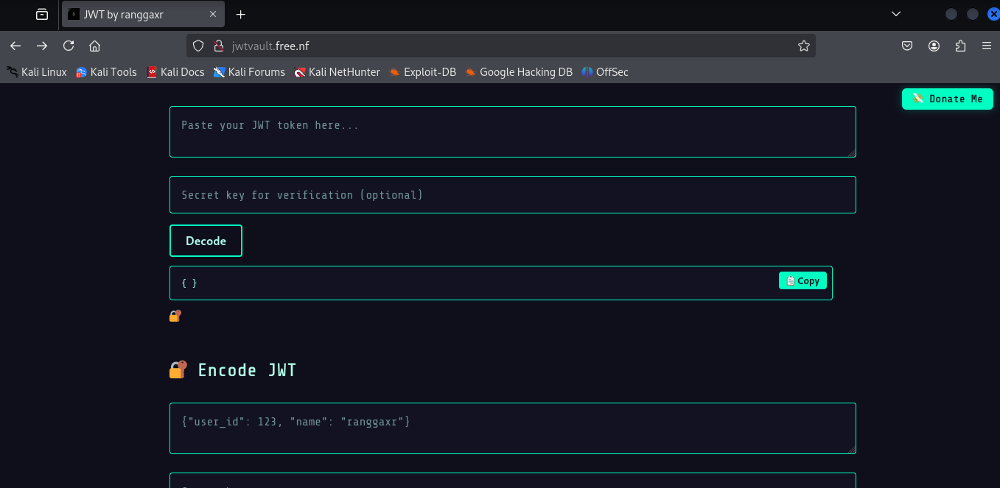

<p align="center">
  
</p>

<h1 align="center">JWT Decoder & Encoder 🔐</h1>

<p align="center">
  A futuristic, fast, and secure tool to encode and decode JSON Web Tokens (JWT).  
  Built for developers, students, and cybersecurity enthusiasts.
</p>

---

## ✨ Features

- 🔓 **Decode** JWT and instantly view the payload and signature status
- 🔐 **Encode** JWT with your custom payload and secret key
- ⚡ Instant result with **client-side only** processing — your data never leaves the browser
- 📋 One-click **Copy** buttons for both output sections
- 🌐 **Language toggle** (English / Indonesian)
- 🖼️ Futuristic neon-styled design
- 🔒 Clear **educational-use disclaimer**

---

## 📸 Preview


---

## 🚀 Getting Started

Just open the `index.html` file in your browser — no installation required.

### Or deploy it live:

- GitHub Pages
- Netlify / Vercel
- Static web hosting (cPanel, Hostinger, etc)

---

## 📁 Project Structure

```
jwt-by-ranggaxr/
├── index.html
├── styles.css
├── script.min.js
├── jsrsasign-all-min.js
├── jwt.png
└── favicon.png
```

---

## 📜 Disclaimer

> This tool is provided for educational and ethical testing purposes only.  
> Any illegal use or unauthorized access is strictly prohibited.  
> Use responsibly. Know the law. Stay ethical.

---

## ❤️ Support This Project

If you find this tool helpful, consider donating:  
👉 [Donate via Saweria](https://saweria.co/ranggaxr)

- Deployment link
[Deployment Link ](http://jwtvault.free.nf/)

---

## 🛠 Built With

- Vanilla JavaScript
- [jsrsasign](https://github.com/kjur/jsrsasign)
- HTML5 + CSS3 (with a futuristic style)

---

## 🧠 License

MIT — free to use, modify, and share.
